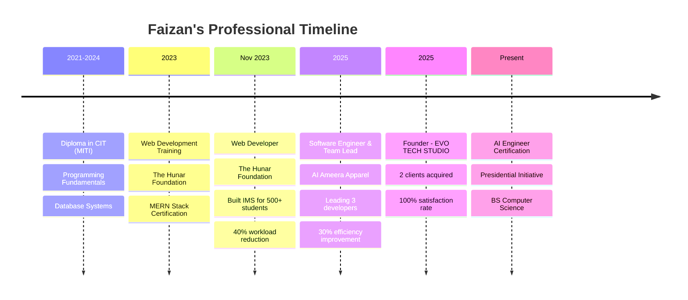

# 
🚀 Welcome to Faizan's Code Universe 🚀

  

  

  

---

##  About Me

🎯 **Current Role:** Software Engineer & Team Lead at AI Ameera Apparel  
🚀 **Entrepreneur:** Founder of EVO TECH STUDIO (Part-time Startup)  
🌍 **Location:** Korangi, Karachi, Pakistan 🇵🇰  
🎓 **Education:** BS Computer Science @ Ilma University (2024-2028)  
📧 **Email:** faizanmatee@gmail.com  
📱 **Phone:** +92 324 3354583  

### 🔥 Quick Highlights
- 💼 **Leading a team of 3 developers** building custom ERP systems
- 📈 **Improved operational efficiency by 30%** through automated workflows  
- 🎯 **Acquired 2 clients** within first quarter of startup operations
- 🏫 **Served 500+ students** with Institute Management System
- ⚡ **100% client satisfaction rate** across all projects

### 🛠️ What I'm Currently Working On
- 🤖 **Agentic and Robotic AI Engineering** (Presidential Initiative)
- 🏢 **Custom ERP System** using C# .NET and SQL Server
- 🌐 **B2B Website Development** projects
- 📱 **Scaling EVO TECH STUDIO** operations

---

##  Tech Stack & Expertise

### 💻 Frontend Mastery

### ⚙️ Backend Powerhouse  

### 🗄️ Database & Storage

### 🛠️ Tools & Platforms

---

##  Professional Journey

---

##  Featured Projects

  
### 🌟 [Personal Portfolio Website](https://faizan-mati.github.io/MyPortfolio/)
**Tech Stack:** HTML5, CSS3, JavaScript, Bootstrap  
**Impact:** 40% increase in qualified leads  
**Features:** Responsive design, SEO-optimized, Interactive UI

### 🏫 Institute Management System (IMS)
**Tech Stack:** PHP, MySQL, HTML5, CSS3, Bootstrap, JavaScript  
**Impact:** Serving 500+ students and 50+ staff  
**Achievement:** 40% reduction in administrative workload

### 🏢 Custom ERP System
**Tech Stack:** C# .NET, SQL Server  
**Impact:** 30% operational efficiency improvement  
**Role:** Team Lead managing 3 developers

---

##  GitHub Analytics

  
  

  

  

---

##  Achievements & Certifications

| 🏆 Achievement | 📅 Year | 🎯 Impact |
|:---|:---:|---:|
| **Founded EVO TECH STUDIO** | 2025 | 2 Clients Acquired |
| **Team Leadership** | 2024-Present | Leading 3 Developers |
| **Operational Efficiency** | 2024 | 30% Improvement |
| **Client Satisfaction** | 2025 | 100% Rating |
| **MERN Stack Certified** | 2024 | Expertizo |
| **AI Engineer Certification** | 2025 | Presidential Initiative |

---

##  Let's Connect & Collaborate

  

---

##  Fun Stats & Metrics

**🎯 Current Focus Areas:**
- 🤖 Artificial Intelligence & Machine Learning
- 🏢 Enterprise Resource Planning Systems  
- 👥 Team Leadership & Project Management
- 🚀 Startup Growth & Client Acquisition

**📊 By The Numbers:**
- 📈 **500+** Students Served
- 👥 **3** Developers Led
- 🎯 **2** Startup Clients
- ⚡ **30%** Efficiency Gains
- 🏆 **100%** Client Satisfaction

---

  

  
**🎯 "Building tomorrow's solutions with today's code"**

*Currently accepting new projects and collaborations!*  
*Let's build something amazing together! 🚀*

