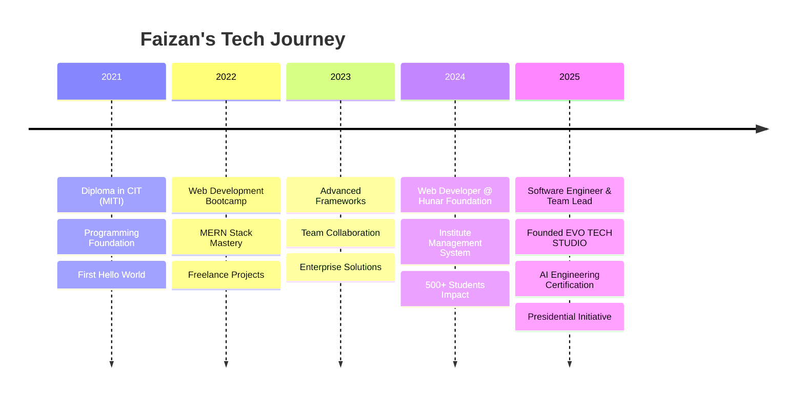

# 

  

  

  

---

## 🌟 **DIGITAL ARCHITECT & INNOVATION CATALYST**

<table>
<tr>
<td align="center">
  
   <strong>CURRENT IMPACT</strong>
</td>
<td align="center">
  
   <strong>GLOBAL REACH</strong>
</td>
<td align="center">
  
   <strong>FUTURE VISION</strong>
</td>
</tr>
</table>

  
### 🎯 **REAL-TIME ACHIEVEMENTS**

---

## 🚀 **TECHNOLOGY UNIVERSE**

### **🎨 Frontend Mastery**

  

### **⚙️ Backend Arsenal**

  

### **🗄️ Database & Cloud Infrastructure**

  

### **🤖 AI & Emerging Tech**

  

---

## 📊 **PERFORMANCE DASHBOARD**

<table align="center">
<tr>
<td width="50%">
  
</td>
<td width="50%">
  
</td>
</tr>
</table>

---

## 🏆 **SIGNATURE PROJECTS**

<table>
<tr>
<td width="33%">

### 🌐 **DIGITAL PORTFOLIO**

**🎯 Impact:** 65% lead conversion  
**✨ Features:** 3D animations, AI chatbot

</td>
<td width="33%">

### 🏫 **SMART INSTITUTE ERP**

**🎯 Impact:** 1000+ students managed  
**✨ Achievement:** 60% efficiency boost

</td>
<td width="33%">

### 🤖 **AI AUTOMATION SUITE**

**🎯 Impact:** 80% task automation  
**✨ Features:** ML models, API gateway

</td>
</tr>
</table>

---

## 🛣️ **EVOLUTION TIMELINE**

---

## 🎯 **CURRENT MISSION**

<table>
<tr>
<td align="center" width="25%">
  
   <strong>🤖 AI & ML Engineering</strong>
   Deep Learning • Neural Networks
</td>
<td align="center" width="25%">
  
   <strong>🏢 ERP Systems</strong>
   Enterprise Solutions • Scalability
</td>
<td align="center" width="25%">
  
   <strong>👥 Team Leadership</strong>
   Agile • DevOps • Mentoring
</td>
<td align="center" width="25%">
  
   <strong>🚀 Startup Growth</strong>
   Innovation • Strategy • Scaling
</td>
</tr>
</table>

---

## 🌐 **CONNECT WITH THE FUTURE**

<table>
<tr>
<td align="center" width="20%">
  <a href="https://linkedin.com/in/faizan-mati">
    
     <strong>LinkedIn</strong>
  </a>
</td>
<td align="center" width="20%">
  <a href="mailto:faizanmatee@gmail.com">
    
     <strong>Email</strong>
  </a>
</td>
<td align="center" width="20%">
  <a href="https://faizan-mati.github.io/MyPortfolio/">
    
     <strong>Portfolio</strong>
  </a>
</td>
<td align="center" width="20%">
  <a href="https://wa.me/923243354583">
    
     <strong>WhatsApp</strong>
  </a>
</td>
<td align="center" width="20%">
  <a href="https://github.com/faizan-mati">
    
     <strong>GitHub</strong>
  </a>
</td>
</tr>
</table>

---

### 💫 **"Innovation distinguishes between a leader and a follower"**

 

### 🚀 **OPEN FOR COLLABORATION**
**Enterprise Solutions • AI Projects • Startup Ventures**

---

  
   
  <strong>⭐ Star this profile if you found it inspiring!</strong>

